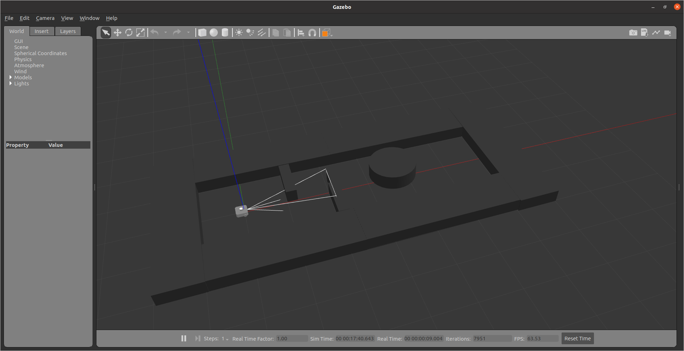

# a-star-path-planning
Path planning using A* algorithm and implementation on turtlebot waffle in Gazebo simulation.

## Author
- Ji Liu - 112960186 (jiliu@umd.edu)
- Yi-Chung Chen - 119218990 (ychen921@umd.edu)

## Dependencies
- numpy
- matplotlib
- multiprocessing
- heapq
- argparse

## Usage
### Part 1 - A* Visualization
**User Inputs**
- `--StartNode {x_y coordinate}`: Start point coordinate (default: 500_1000)
- `--GoalNode {x_y coordinate}`: Goal point coordinate (default: 5750_1000)
- `--Ori {Degree}`: The orientation of the Robot at the start point (default: 0)
- `--rpm1 {Wheel’s RPM}`: Left Wheel's RPM (default: 20.0)
- `--rpm2 {Wheel’s RPM}`: Right Wheel's RPM (default: 40.0)
- `--rr {clearance}`: Clearance in mm (default: 220)

To run the default config of [astar_sim.py](astar_sim.py), use this command
```
python3 astar_sim.py
```

The following command represents the the setting of every user input
```
python3 astar_sim.py --rpm1 50.0 --rpm2 100.0 --StartNode 200_200 --GoalNode 5750_500 --Ori 30 --rr 50
```

### Part 2 - Gazebo Simulation
Source ROS
```
source install/setup.bash
```

Build the workspace
```
cd project3_ws
colcon build --packages-select turtlebot3_project3
```

Launch Environment
```
ros2 launch turtlebot3_project3 competition_world.launch.py
```

To run the ROS node, you can use the [vel_publisher.py](/project3_ws/src/turtlebot3_project3/scripts/vel_publisher.py) for the following:

```
ros2 run turtlebot3_project3 vel_publisher.py
```
To adjust the goal point, use `--GoalNode` to set the point. Here is an example:
```
ros2 run turtlebot3_project3 vel_publisher.py ---GoalNode 5750_500
```

## Demo
- A* Visualization
[](https://youtu.be/kb4CH7fvLws)
- Gazebo Simulation
[](https://youtu.be/tKGekSLWd3s)
